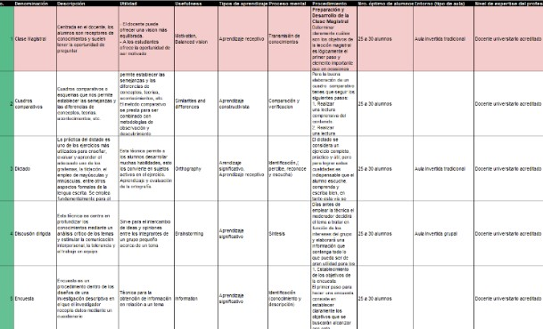

# Implementaciones PDT 
## Contenido
Contenido de las implementaciones

- Réplicas o pruebas
- Lectura a la base de datos
- Filtros basado en contenidos
- Filtros colaborativos

## Características

## Base de datos
### Recopilación de TEAs en Excel

### Configuración con los siguientes parámetros:

| Parámetros | Valores |
| ------ | ------ |
| host | localhost |
| user | root |
| passwd | admin |
| database | tecnicasdb |

## Instalaciones

## Pruebas

